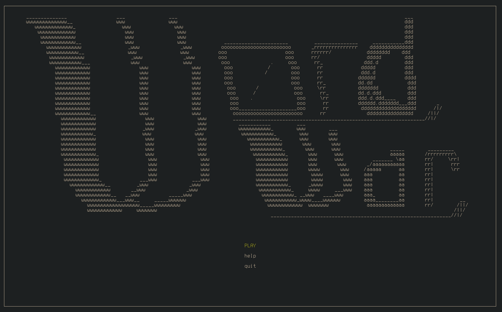
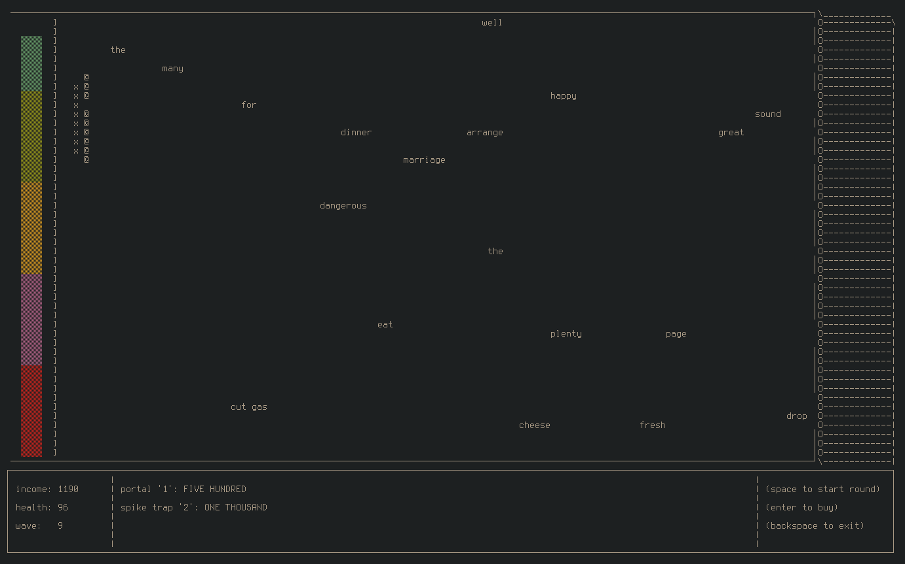

# wordwar
Terminal based typing practice program that has been gamified. Using Ncurses with cpp.

# compiling
you will need to have a the g++ compiler and the ncurses library installed, then simply run make

