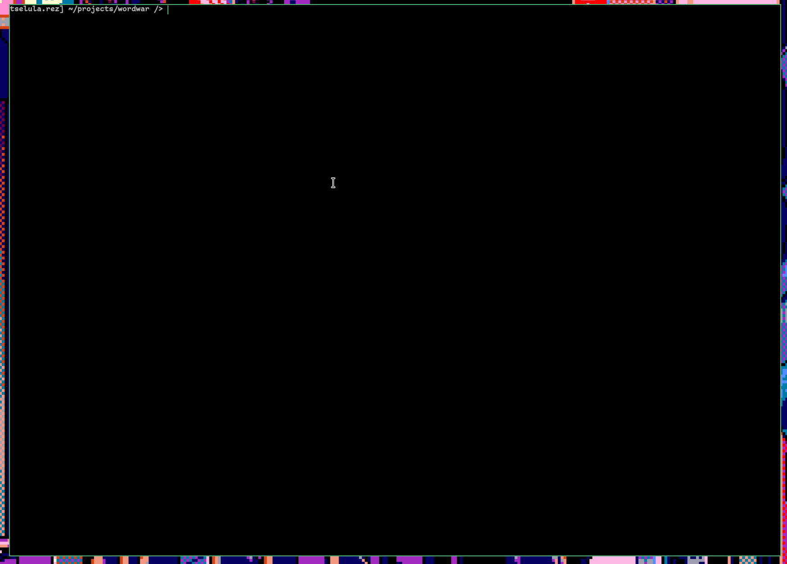

Terminal based typing practice program that has been gamified. Using Ncurses with cpp.

## BUILDING
To build you will need to install ncurses-dev. On debian systems you may use: sudo apt install libncurses-dev
Finally, simply run make.

## USAGE

Arrow keys to move between buttons. Enter to select choice. Backspace to go to previous screen.

